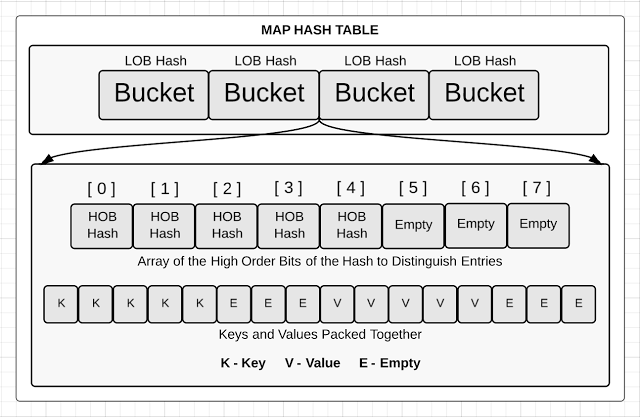
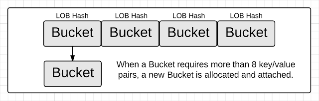

# Macro View of Map

Golang Maps is a collection of unordered pairs of key-value. It is widely used because it provides fast lookups and values that can retrieve, update or delete with the help of keys.

## How Maps Are Structured

The hash table for a Go map is structured as an array of buckets. The number of buckets is always equal to a power of 2. When a map operation is performed, a hash key is generated against the key that is specified.

Once a bucket is selected, the key/value pair needs to be stored, removed or looked up, depending on the type of operation. If we look inside any bucket, we will find two data structures. First, there is an array with the top 8 high order bits (HOB) from the same hash key that was used to select the bucket. This array distinguishes each individual key/value pair stored in the respective bucket. Second, there is an array of bytes that store the key/value pairs. The byte array packs all the keys and then all the values together for the respective bucket.

## Memory and Bucket Overflow

There is a reason the key/value pairs are packed like this in a single byte array. If the keys and values were stored like key/value/key/value, padding allocations between each key/value pair would be needed to maintain proper alignment boundaries.

A bucket is configured to store only 8 key/value pairs. If a ninth key needs to be added to a bucket that is full, an overflow bucket is created and reference from inside the respective bucket.

As we continue to add or remove key/value pairs from the map, the efficiency of the map lookups begin to deteriorate. The load threshold values that determine when to grow the hash table are based on these four factors:

- **% overflow**   = percentage of buckets which have an overflow bucket
- **bytes/entry**  = overhead bytes used per key/elem pair
- **hitprobe**     = # of entries to check when looking up a present key
- **missprobe**    = # of entries to check when looking up an absent key

Currently, the code uses the following load threshold values:

| LOAD | %overflow | bytes/entry | hitprobe | missprobe |
|------|-----------|-------------|----------|-----------|
| 6.00 | 15.27     | 11.67       |   4.00   | 6.00      |

Growing the hash table starts with assigning a pointer called the "old bucket" pointer to the current bucket array. Then a new bucket array is allocated to hold twice the number of existing buckets. This could result in large allocations, but the memory is not initialized so the allocation is fast.

Once the memory for the new bucket array is available, the key/value pairs from the old bucket array can be moved or "evacuated" to the new bucket array. Evacuations happen as key/value pairs are added or removed from the map. The key/value pairs that are together in an old bucket could be moved to different buckets inside the new bucket array. The evacuation algorithm attempts to distribute the key/value pairs evenly across the new bucket array.

This is a very delicate dance because iterators still need to run through the old buckets until every old bucket has been evacuated.
