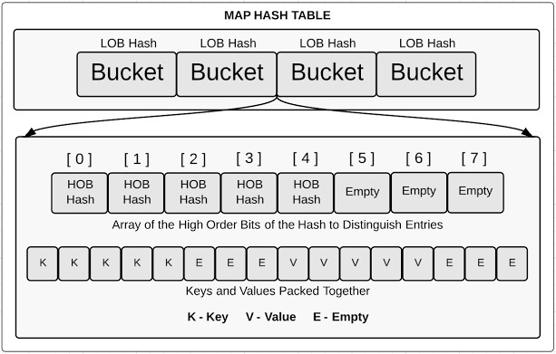
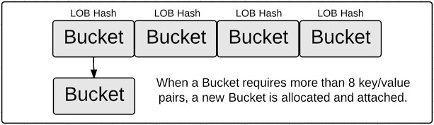

# Macro View of Map

Maps is a collection of unordered pairs of key-value. It is widely used because it provides fast lookups and values that can retrieve, update or delete with the help of keys.

## How Maps Are Structured

A map is essentially a [hash table](https://en.wikipedia.org/wiki/Hash_table) where data is organized into an array of buckets. The number of buckets always equals a power of two. When a mapping operation occurs, a hash key is generated based on the specified key.

The low-order bits of the hash are used to select a bucket. If we look inside any bucket, we will find two data structures, an array containing the top 8 high-order bits (HOBs) from the same hash key used to select the bucket, which distinguishes each key-value pair stored within the bucket; and a byte array storing the key-value pairs, with the keys and values packed together for the specific bucket.

## Memory and Bucket Overflow

There is a reason why keys and values are packed together in a bucket. If they were stored as key/value/key/value, padding allocations would be necessary between each key/value pair to maintain proper alignment boundaries.

A bucket is designed to hold only 8 key-value pairs. If a ninth key needs to be added to a full bucket, an overflow bucket is created and referenced from the respective bucket.

Continuing to add or remove key-value pairs from a map can affect the efficiency of map lookups. The load threshold values that determine when to expand the hash table are based on four factors.

- **% overflow**  : percentage of buckets which have an overflow bucket
- **bytes/entry** : overhead bytes used per key/elem pair
- **hitprobe**    : # of entries to check when looking up a present key
- **missprobe**   : # of entries to check when looking up an absent key

Currently, the code uses the following load threshold values:

| loadFactor | %overflow | bytes/entry | hitprobe | missprobe |
|------------|-----------|-------------|----------|-----------|
| 6.50       | 20.90     | 10.79       |   4.25   | 6.50      |

Expanding the hash table begins by assigning a pointer known as the "old bucket" pointer to the current bucket array. A new bucket array is then allocated to hold twice the number of existing buckets, which may result in large allocations, but since the memory is not initialized, the allocation process is fast.

Once the memory for the new bucket array is allocated, the key-value pairs from the old bucket array can be transferred or "evacuated" to the new array. Evacuations occur when key-value pairs are added or removed from the map. The key-value pairs that were together in an old bucket may be moved to different buckets within the new array, and the evacuation algorithm attempts to distribute the key-value pairs evenly throughout the new bucket array.

This process is delicate, as iterators still need to traverse the old buckets until all of them have been evacuated.
